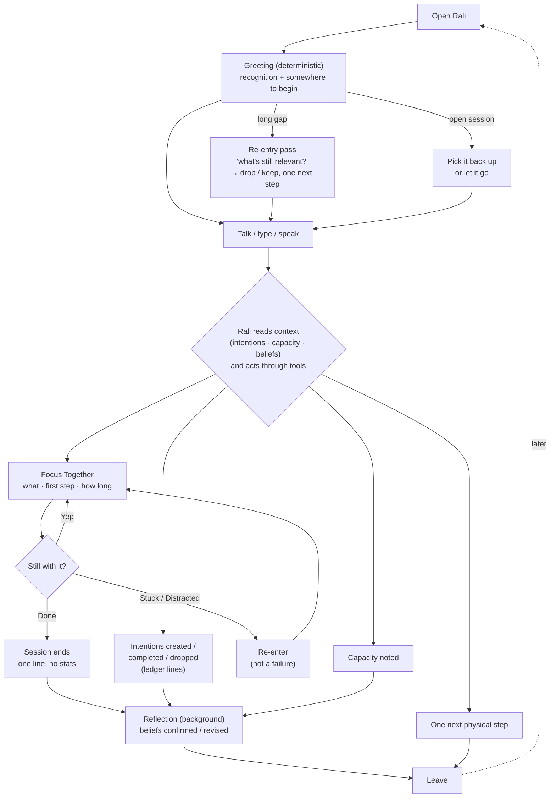

# User Journey

The loop, not a funnel. There is no onboarding beyond signing in.

## States at a glance

| State | Where it lives | Who changes it |
|---|---|---|
| Intention open / done / dropped | `intentions.status` | Rali via tools; user via Today |
| Focus session active / ended / abandoned | `focus_sessions` | Rali via tools; client timer; next-visit sweep |
| Today's capacity | latest `capacity.reported` event | Rali via tool |
| Beliefs | `memory_notes` (+ confidence, evidence) | Rali via tools; reflection; user via "What Rali knows" |
| Visit gap | `users.last_seen_at` | every turn / page open |

## Open questions
- Where does a user *see* that an intention was captured without turning Today into a task list? (Ledger lines under the message are the M3 answer.)
- When a session is abandoned, is the next-visit prompt a greeting variant (current plan) or a silent close?
